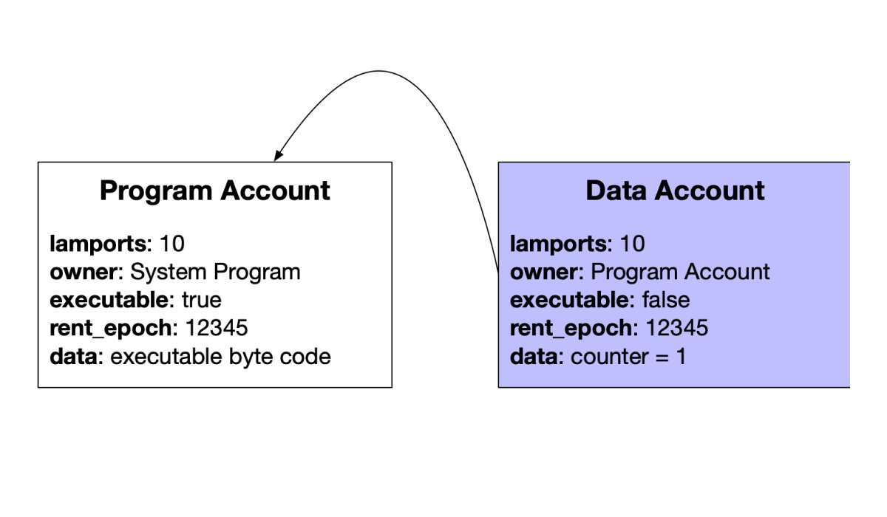

# Accounts

Solana 内的帐户用于存储状态。它们是在 Solana 上进行开发的重要构建块。

## 事实

> 情况说明书
> - 账户用于存储数据
> - 每个账户都有一个唯一的地址
> - 帐户的最大大小为 10MB（10 兆字节）
> - PDA 帐户的最大大小为 10KB（10 千字节）
> - PDA 帐户可用于代表程序签名
> - 帐户大小在创建时是固定的，但可以使用 [realloc]() 进行调整
> - 账户数据存储是通过租金支付的
> - 默认帐户所有者是系统程序

## 深入

### 账户模型

Solana 上有 3 种账户：

- 数据帐户存储数据
- 程序帐户存储可执行程序
- 本机帐户表示 Solana 上的本机程序，例如系统、权益和投票

数据帐户内有 2 种类型：

- 系统拥有的帐户
- PDA（程序派生地址）帐户

每个帐户都有一个地址（通常是公钥）和所有者（程序帐户的地址）。帐户存储的完整字段列表如下。

| 字段  | 描述 |
| ------------- | ------------- |
| `lamports`  | 帐户中的 lamports 数量  |
｜ `owner`  | 该帐户的程序所有者 |
| `executable` | 该账户是否可以处理指令 |
| `data` | 该账户存储的原始数据字节数组 |
| `rent_epoch` | 该帐户将欠租金的下一个纪元 |

有一些重要的所有权规则：

- 只有数据帐户的所有者才能修改其 Data 和 `debit lamports`
- 任何人都可以将credit lamports记入数据帐户
- 如果帐户的数据被清零，帐户的所有者可以分配新的所有者

程序帐户不存储状态。

例如，如果您有一个可以递增计数器的计数器程序，则必须创建两个帐户，一个帐户用于存储程序代码，另一个帐户用于存储计数器。

为了防止帐户被删除，您必须支付租金。

### Rent

存储账户数据需要 SOL 来维护，其资金来源是所谓的租金。如果您的账户中的最低余额相当于 2 年租金，您的账户将免缴租金。您可以通过关闭帐户并将lamports发送回您的钱包来收回租金。

租金在两个不同的时间支付：

1. 当被交易引用时
2. 曾经一个epoch

账户收取的一定比例的租金将被销毁，其余的则在每个时段结束时分配给投票账户。

如果帐户没有足够的租金，该帐户将被取消分配，数据将被删除。

还需要注意的是，新帐户必须免租。

## 其他资源

- [Solana 账户模型](https://solana.wiki/zh-cn/docs/account-model/#account-storage)
- [Solana Docs](https://docs.solana.com/developing/programming-model/accounts)
- [pencilflip threads](https://twitter.com/pencilflip/status/1452402100470644739)

### Credit

这一核心概念归功于 [Pencilflip](https://twitter.com/intent/user?screen_name=pencilflip)。在推特上关注他。
