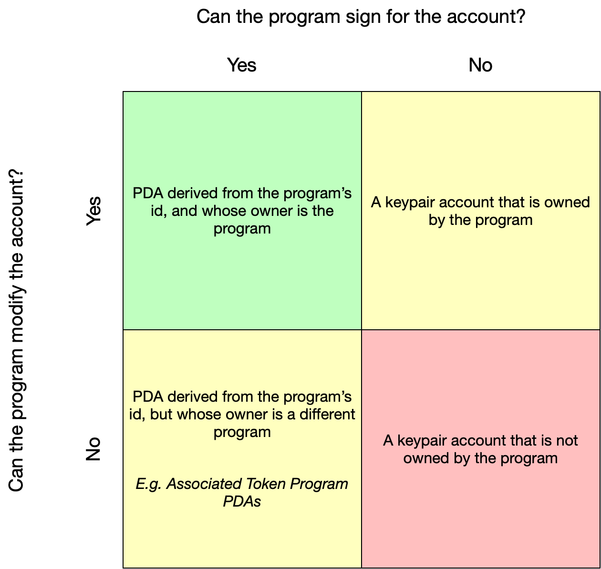

# Program Derived Addresses(PDA)

程序派生地址（PDAs）是专为特定程序控制的账户而设计的。通过PDAs，程序可以以编程方式为特定地址签名，而无需私钥。PDAs是[跨程序调用](https://docs.solana.com/developing/programming-model/calling-between-programs#cross-program-invocations)的基础，使得Solana应用程序可以相互组合。

## 事实

> 事实简报
>
> - PDA是32字节的字符串，看起来像公钥，但没有相应的私钥
> - 将从程序ID和种子（一组字节）确定性地推导出一个PDA (`findProgramAddress` will deterministically derive a PDA from a programId and seeds (collection of bytes))
> - 使用一个字节的“bump”将一个潜在的PDA从ed25519椭圆曲线上推开
> - 程序可以通过提供种子和碰撞来[为其PDA签名](https://docs.solana.com/developing/programming-model/calling-between-programs#program-signed-accounts)以调用已签名的程序 (Programs can sign for their PDAs by providing the seeds and bump to invoke_signed)
> - PDA只能由其衍生的程序进行签名
> - 除了允许程序为不同的指令签名外，PDA还提供了类似哈希映射的接口来[索引账户](https://solanacookbook.com/guides/account-maps.html)

## 深入挖掘

PDA是在Solana上开发程序的基本构建模块。通过PDA，程序可以为账户签名，同时确保没有外部用户能够为同一账户生成有效的签名。除了为账户签名外，某些程序还可以修改其所持有的PDA账户。

### 生成PDA

要理解PDA背后的概念，可以考虑一下PDA并非技术上创造出来的，而是被发现的。PDA是由一系列种子（例如字符串 “`vote_account`” ）和程序ID组合而成的。这些种子和程序ID的组合会通过sha256哈希函数运行，以确定它们是否生成了一个位于ed25519椭圆曲线上的公钥。

在通过哈希函数运行我们的程序ID和种子时，我们实际上有大约50%的机会得到一个位于椭圆曲线上的有效公钥。在这种情况下，我们只需稍微修改我们的输入并再次尝试。这种修改因素的技术术语称为“bump”。在Solana中，我们从bump = 255开始，然后依次递减，直到我们得到一个不在椭圆曲线上的地址。这可能看起来很基础，但一旦找到，它就为我们提供了一种确定性的方法，可以反复派生出相同的PDA。

### 与（PDA）的互动

当生成一个PDA时， `findProgramAddress` 将返回用于将地址从椭圆曲线上踢出的地址和bump。有了这个bump，程序可以为需要其PDA的任何指令签名。为了签名，程序应将指令、账户列表以及用于派生PDA的种子和bump传递给 `invoke_signed` 。除了为指令签名外，PDA还必须通过 `invoke_signed` 为自己的创建签名。

在使用PDA进行构建时，将[碰撞种子存储](https://github.com/solana-labs/solana-program-library/blob/78e29e9238e555967b9125799d7d420d7d12b959/token-swap/program/src/state.rs#L100)在账户数据本身中是很常见的。这样可以让开发人员在不必将碰撞作为指令参数传递的情况下轻松验证PDA。

## 其他资源

- [Program Derived Addresses](https://docs.solana.com/developing/programming-model/calling-between-programs#program-derived-addresses)
- [Understanding Program Derived Addresses](https://www.brianfriel.xyz/understanding-program-derived-addresses/)
